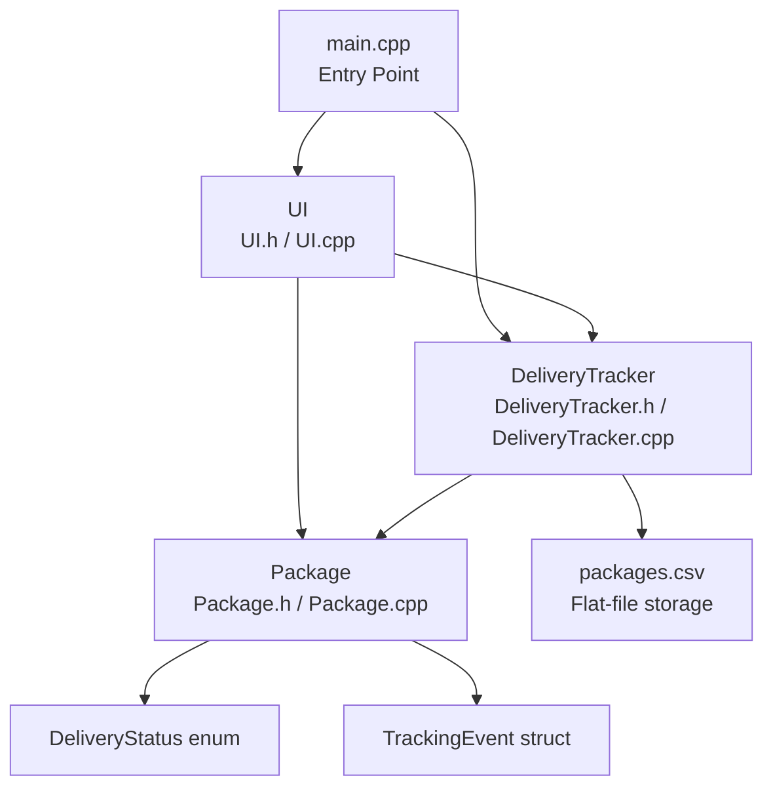
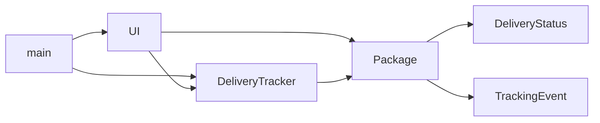

# Architecture

## Overview

The Delivery Tracking System is a single-process, console-based C++17 application.
It is structured in three cleanly separated layers: a **data model**, a **business
logic / persistence** layer, and a **user interface** layer. There is no networking,
no database engine, and no external dependencies — all data is stored in a local CSV
file on disk.

---

## Layer Diagram



---

## Components

### `main.cpp` — Entry Point

Owns program startup and shutdown. Constructs a `DeliveryTracker` (which immediately
loads `packages.csv`) and a `UI` (which holds a reference to the tracker). Wraps the
entire session in a `try/catch` block to print fatal errors and exit with code 1.

No application logic lives here.

---

### `Package.h` / `Package.cpp` — Data Model

Defines the three types that model a shipment:

| Type | Kind | Responsibility |
|---|---|---|
| `DeliveryStatus` | `enum class` | Seven possible states a package can be in |
| `TrackingEvent` | `struct` | One timestamped history entry |
| `Package` | `class` | A complete shipment record with full event history |

`Package` owns its own data and exposes it only through const getters. The only two
ways to change its state are `updateStatus()` (for live operations during a session)
and `restoreFromHistory()` (used only when loading from file). Static utility methods
`statusToString()`, `stringToStatus()`, and `currentTimestamp()` handle all
enum-to-string conversions and timestamp formatting.

---

### `DeliveryTracker.h` / `DeliveryTracker.cpp` — Business Logic and Persistence

The central coordinator. Owns the in-memory store of all packages as an
`std::unordered_map<std::string, Package>` and is the only component that reads or
writes `packages.csv`.

Responsibilities:

- **CRUD**: `addPackage`, `updateStatus`, `findPackage`
- **Queries**: `searchBySender`, `searchByReceiver`, `filterByStatus`, `getAllPackages`
- **Statistics**: `printSummary`
- **Persistence**: `loadFromFile`, `saveToFile`, and four private CSV helper methods

`DeliveryTracker` depends on `Package` but has no knowledge of the UI.

---

### `UI.h` / `UI.cpp` — Console User Interface

Drives the interactive session. Holds a non-owning reference (`DeliveryTracker&`) to
the tracker and delegates all data operations to it. Contains zero business logic —
every meaningful operation is a call into `DeliveryTracker`.

Responsibilities:

- Render the main menu and all sub-screens
- Collect and validate user input
- Gate the status-update operation behind an admin key check (hardcoded as `"12345"`)
- Format and display package data to stdout

`UI` depends on both `DeliveryTracker` and `Package` (for display formatting and the
`DeliveryStatus` enum).

---

## Dependency Graph



Arrows mean "depends on / uses directly". `main.cpp` constructs both top-level
objects. `UI` never constructs or owns packages — it hands data to `DeliveryTracker`
and receives `Package*` pointers back for display only.

---

## File Structure

```
Delivery Tracking System/
├── include/
│   ├── Package.h           # DeliveryStatus, TrackingEvent, Package
│   ├── DeliveryTracker.h   # DeliveryTracker (business logic + persistence)
│   └── UI.h                # UI (console presentation layer)
├── src/
│   ├── main.cpp            # Entry point
│   ├── Package.cpp         # Package implementation
│   ├── DeliveryTracker.cpp # DeliveryTracker implementation
│   └── UI.cpp              # UI implementation
├── docs/                   # This documentation
├── packages.csv            # Flat-file data store (auto-created on first add)
├── CMakeLists.txt          # CMake build definition
└── build.bat               # Windows convenience build script
```

---

## Key Design Decisions

**`std::unordered_map<string, Package>` for storage**
Provides O(1) average-case lookup by tracking ID. Iteration order is unspecified,
so list and search results are not sorted.

**Immediate persistence**
`saveToFile()` is called after every `addPackage` and `updateStatus` call, so no
in-session data is lost if the process is killed.

**`restoreFromHistory()` for file loading**
When loading from CSV, calling `updateStatus()` would generate new timestamps and
corrupt the stored history. `restoreFromHistory()` bypasses this by directly
replacing `history_` and `createdAt_` with the saved values.

**No friendship or global state**
All inter-component communication goes through public method calls. `UI` receives a
`DeliveryTracker&` by reference at construction and uses it for the lifetime of the
session. There are no global variables.
