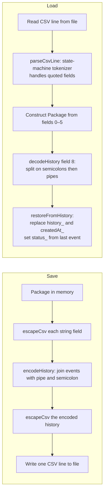

# Data Model

## Overview

The system's data model consists of three types defined in `Package.h`:

- `DeliveryStatus` — a scoped enum representing a package's current state
- `TrackingEvent` — a struct representing one point-in-time status record
- `Package` — a class representing a complete shipment, including its full history

All three types are defined in `include/Package.h` and implemented in `src/Package.cpp`.

---

## `DeliveryStatus` Enum

```cpp
enum class DeliveryStatus {
    PENDING,            // 0 — registered, not yet collected
    PICKED_UP,          // 1 — collected from sender
    IN_TRANSIT,         // 2 — moving between hubs
    OUT_FOR_DELIVERY,   // 3 — on the last-mile vehicle
    DELIVERED,          // 4 — handed to recipient
    FAILED,             // 5 — delivery attempt failed
    RETURNED            // 6 — being returned to sender
};
```

The integer values (0–6) are used as array indices in `DeliveryTracker::printSummary`
to accumulate per-status counts. Any reordering of the enum values would break that
array indexing.

String conversions are handled by two static methods on `Package`:

| String | Enum value |
|---|---|
| `"Pending"` | `PENDING` |
| `"Picked Up"` | `PICKED_UP` |
| `"In Transit"` | `IN_TRANSIT` |
| `"Out for Delivery"` | `OUT_FOR_DELIVERY` |
| `"Delivered"` | `DELIVERED` |
| `"Failed"` | `FAILED` |
| `"Returned"` | `RETURNED` |

`stringToStatus` throws `std::invalid_argument` for any unrecognised string.
`statusToString` returns `"Unknown"` for any unhandled enum value.

---

## `TrackingEvent` Struct

```cpp
struct TrackingEvent {
    std::string    timestamp;   // "YYYY-MM-DD HH:MM:SS"
    DeliveryStatus status;      // the status at this moment
    std::string    location;    // free-text city or place name
    std::string    note;        // free-text note; may equal statusToString(status)
};
```

`TrackingEvent` is a plain aggregate with no constructor. Fields are set directly
by `Package::updateStatus()` and `DeliveryTracker::decodeHistory()`.

The `note` field defaults to `statusToString(status)` when `updateStatus` is called
with an empty note. The display layer (`printPackageDetail`) suppresses the note
if it exactly equals `statusToString(status)` to avoid redundant output.

---

## `Package` Class

### Fields

| Field | Type | Set by | Description |
|---|---|---|---|
| `id_` | `string` | Constructor | Tracking ID, format `PKG-XXXXXX` |
| `sender_` | `string` | Constructor | Name of the sender |
| `receiver_` | `string` | Constructor | Name of the recipient |
| `origin_` | `string` | Constructor | Origin location |
| `destination_` | `string` | Constructor | Destination location |
| `weightKg_` | `double` | Constructor | Weight in kilograms, always > 0 |
| `status_` | `DeliveryStatus` | Constructor / `updateStatus` / `restoreFromHistory` | Current status — always mirrors `history_.back().status` |
| `createdAt_` | `string` | Constructor / `restoreFromHistory` | Timestamp of first construction |
| `history_` | `vector<TrackingEvent>` | Constructor / `updateStatus` / `restoreFromHistory` | Full ordered event log |

### Invariant

`status_` always equals `history_.back().status`. This is maintained by:
- The constructor, which sets both `status_ = PENDING` and pushes a `PENDING` event.
- `updateStatus()`, which sets `status_` and appends a matching event atomically.
- `restoreFromHistory()`, which sets `status_ = history.back().status`.

---

## In-Memory Store

`DeliveryTracker` holds all packages in:

```cpp
std::unordered_map<std::string, Package> packages_;
```

- Key: tracking ID string (e.g. `"PKG-847321"`)
- Value: `Package` object stored by value
- Lookup: O(1) average via hash

`findPackage`, `updateStatus`, `searchBySender`, `searchByReceiver`,
`filterByStatus`, and `getAllPackages` all return raw `Package*` pointers into
this map. These pointers are invalidated if the map is rehashed (i.e. after an
insertion that triggers rehash). In practice, pointers are used and discarded
within a single handler call, never held across a map modification.

---

## CSV File Structure

File: `packages.csv` (located in the working directory at runtime)

### Header

```
id,sender,receiver,origin,destination,weight,status,createdAt,history
```

### Column layout

| Column index | Name | Type | Example |
|---|---|---|---|
| 0 | `id` | quoted string | `"PKG-605552"` |
| 1 | `sender` | quoted string | `"John Doe"` |
| 2 | `receiver` | quoted string | `"Jane Smith"` |
| 3 | `origin` | quoted string | `"New York"` |
| 4 | `destination` | quoted string | `"Los Angeles"` |
| 5 | `weight` | plain double | `2.5` |
| 6 | `status` | quoted string | `"Pending"` |
| 7 | `createdAt` | quoted string | `"2026-10-04 14:09:31"` |
| 8 | `history` | quoted encoded string | see below |

### Sample row

```
"PKG-605552","John Doe","Jane Smith","New York","Los Angeles",2.5,"Pending","2026-10-04 14:09:31","2026-10-04 14:09:31|Pending|New York|Package registered."
```

### History encoding

The `history` column encodes the full `vector<TrackingEvent>` as a single string
within the outer CSV quoting:

```
timestamp|status|location|note;timestamp|status|location|note;...
```

- Events are separated by `;`
- Fields within an event are separated by `|`
- The note field consumes everything after the third `|`, so notes may contain `|`
  but not `;`

Multi-event example (two events):
```
2026-10-04 15:04:15|Pending|BBS|Package registered.;2026-10-04 15:05:06|Out for Delivery|Gopalpur|Out for Delivery
```

---

## Serialization / Deserialization Flow



### Quote escaping rules

On save (`escapeCsv`):
- Wrap the entire field value in `"..."`.
- Any `"` character inside the value becomes `""`.

On load (`parseCsvLine` state machine):
- A `"` outside quotes enters quote mode.
- Inside quote mode, `""` is decoded as a single `"`.
- A lone `"` inside quote mode exits quote mode.
- `,` outside quote mode splits a field.

`unescapeCsv` is defined in `DeliveryTracker.cpp` but is not called anywhere in the
current implementation — `parseCsvLine` handles unquoting directly.
