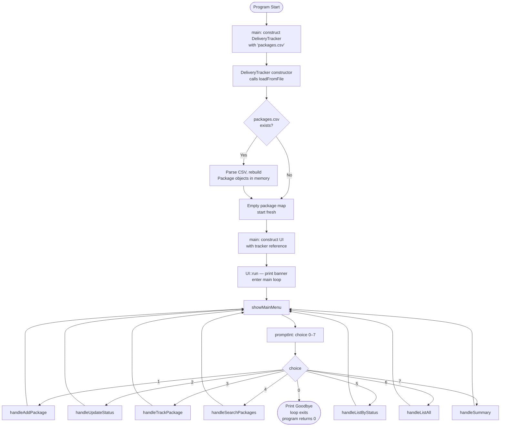
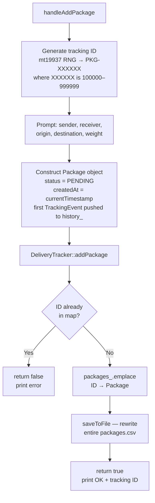
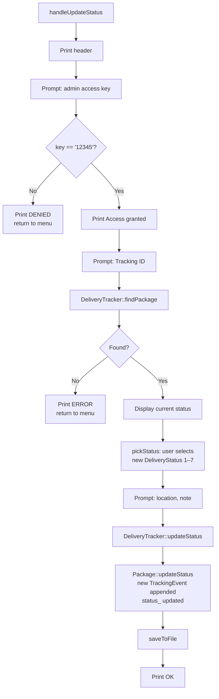
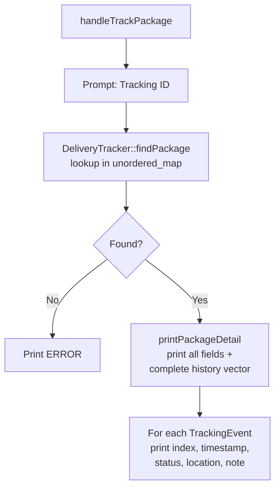
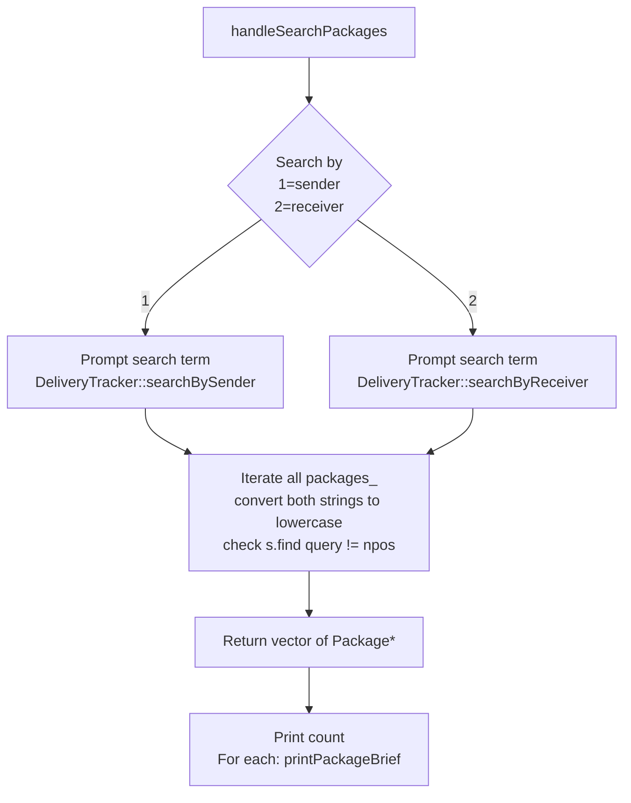
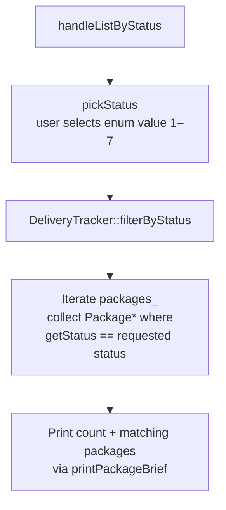
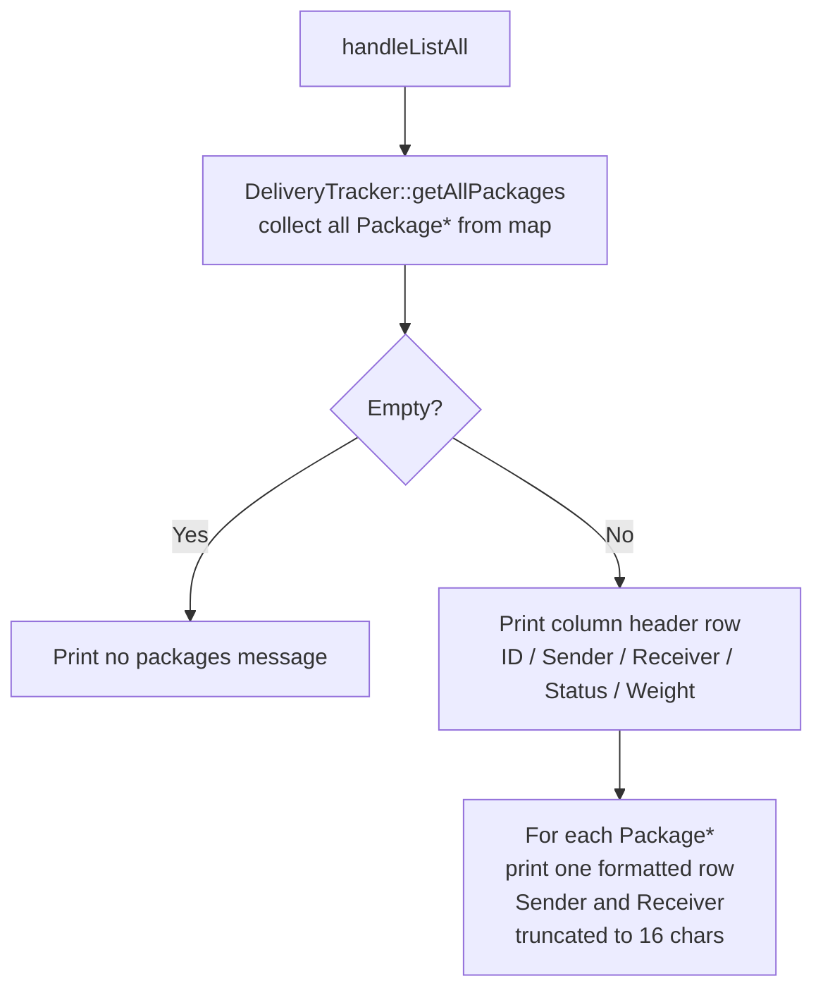
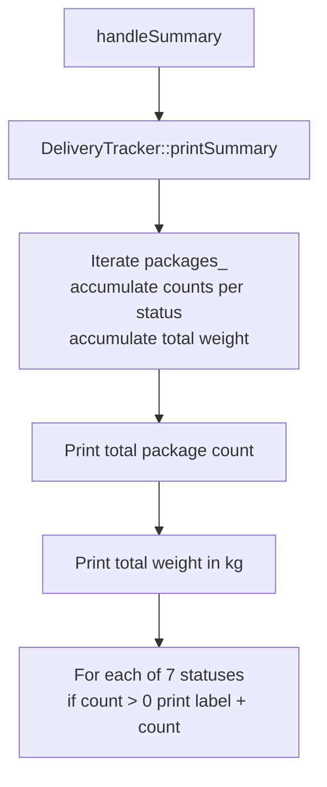
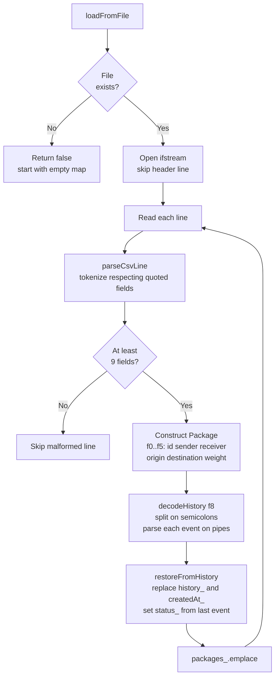
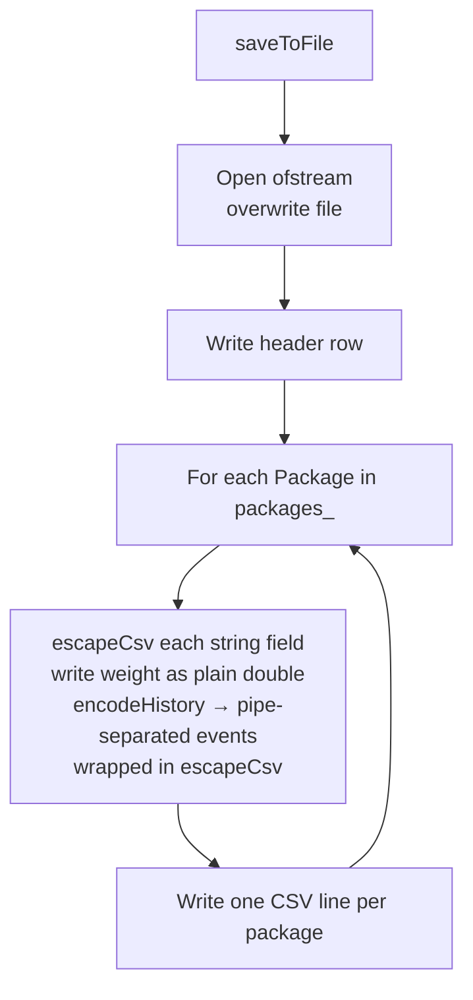

# System Workflow

## Application Lifecycle

---

## Package Creation (Menu Option 1)

The tracking ID is generated inside `handleAddPackage` using a `static std::mt19937`
seeded from `std::random_device`. The format is always `PKG-` followed by a six-digit
integer in the range 100000–999999.

---

## Status Update (Menu Option 2)

The admin key `"12345"` is checked with a plain string comparison in `handleUpdateStatus`.
If it does not match, the function returns immediately without touching the tracker.

---

## Package Tracking (Menu Option 3)

`printPackageDetail` iterates the `history_` vector in order (index 0 is always the
registration event). Notes that equal the status string are suppressed to avoid
redundancy.

---

## Package Search (Menu Option 4)

Search is case-insensitive and substring-based. Both the stored field and the query
are converted to lowercase with `std::transform` before comparison.

---

## Filter by Status (Menu Option 5)

---

## List All Packages (Menu Option 6)

Iteration order over the `unordered_map` is implementation-defined, so the list order
is not guaranteed to be insertion order or alphabetical.

---

## Summary / Statistics (Menu Option 7)

---

## CSV Load (Startup)

---

## CSV Save (After Every Write Operation)

`saveToFile` always rewrites the entire file from the in-memory map. There is no
append-only mode.
